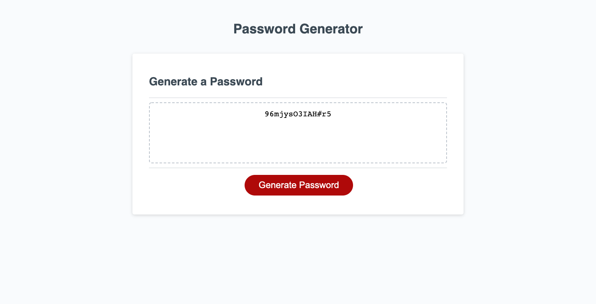

# Password-Generator
DESCRIPTION:
    With prewritten HTML and CSS, I created a random password generator using JavaScript. This allows for the user to select a password with a length between 8-128 characters. The user also gets to select the type of characters they would like to use, with the options of lowercase, uppercase, numbers, and/or special characters.

LINK TO PAGE:
    https://konnerhartman.github.io/Random_Password_Generator/

SCREEN CAPTURE:

